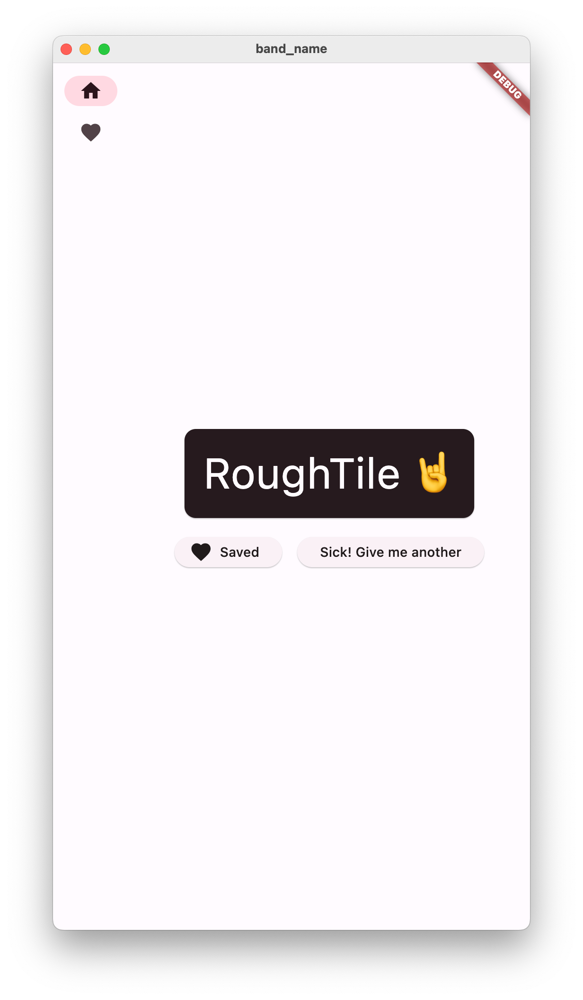
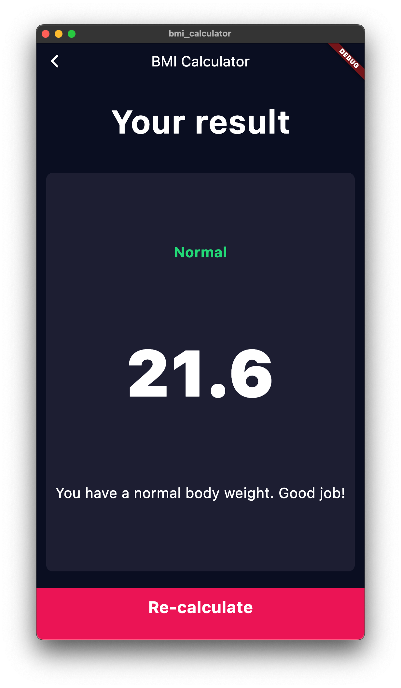

# Flutter

This is a playground for projects as I learn Flutter. Nothing here is intended to be polished or even functional.

## Projects

### [Hello, world](/hello_world/)

A ‘Hello, world’ button click counter based on Flutter’s [‘Test drive’](https://docs.flutter.dev/get-started/test-drive) getting started project.

### [Band name generator](/band_name/)

A band name generator based on Flutter’s [‘Write your first app’](https://docs.flutter.dev/get-started/codelab) codelab.

### [Xylophone](/xylophone/)

A xylophone musical instrument based on App Brewery’s [Xylophone](https://github.com/londonappbrewery/Flutter-Course-Resources?tab=readme-ov-file#section-9-xylophone---using-flutter-and-dart-packages-to-speed-up-development) project (part of the [Flutter bootcamp with Dart](https://www.udemy.com/course/flutter-bootcamp-with-dart/) Udemy course).

### [BMI Calculator](/bmi_calculator/)

A body mass index calculator based on App Brewery’s [BMI Calculator](https://github.com/londonappbrewery/Flutter-Course-Resources?tab=readme-ov-file#section-12-bmi-calculator---building-flutter-uis-for-intermediates) project (part of the [Flutter bootcamp with Dart](https://www.udemy.com/course/flutter-bootcamp-with-dart/) Udemy course).

### [Weather](/weather/)

A weather app powered by OpenWeatherMap based on App Brewery’s [Clima](https://github.com/londonappbrewery/Flutter-Course-Resources?tab=readme-ov-file#section-13-clima---powering-your-flutter-app-with-live-weather-web-data) project (part of the [Flutter bootcamp with Dart](https://www.udemy.com/course/flutter-bootcamp-with-dart/) Udemy course).

### [To-do](/todo)

A to-do list app based on from App Brewery’s [Todoey](https://github.com/londonappbrewery/Flutter-Course-Resources?tab=readme-ov-file#section-13-clima---powering-your-flutter-app-with-live-weather-web-data) project (part of the [Flutter bootcamp with Dart](https://www.udemy.com/course/flutter-bootcamp-with-dart/) Udemy course).

